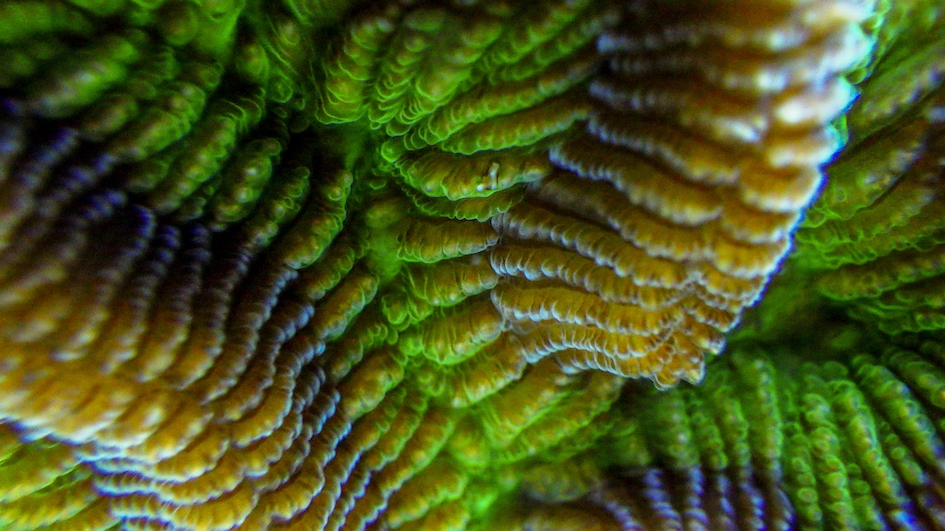
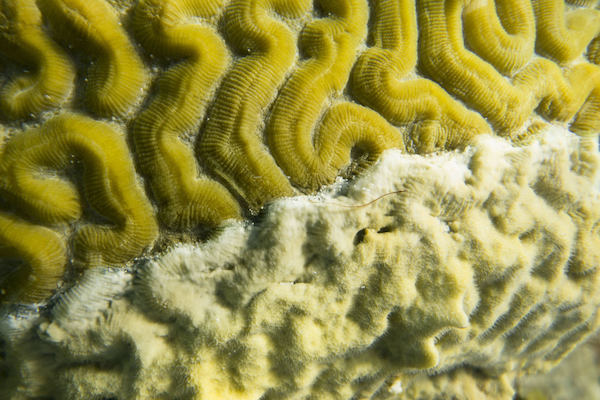

Corals are not single organisms but holobionts: the animal host together with the bacteria, archaea, protists, and viruses that live in association with it. These microbial partners shape host physiology, including the capacity to withstand environmental stress. We study the holobiont as an integrated system, pairing microbiome metabarcoding (16S and 18S rRNA, resolving both the prokaryome and the eukaryome) with host transcriptomics so that host and microbes can be read together. The same toolkit lets us ask one question through three lenses — how the holobiont varies across **space** within a colony, across **time** through the diel cycle, and across the shift from **health to disease**.

### One colony, many niches — Modularity in the Mediterranean octocoral holobiont

Mediterranean gorgonians are foundational species of coralligenous reefs, building the three-dimensional habitat that sustains much of the basin's benthic biodiversity. They are also among the organisms most exposed to the climate crisis: recurrent marine heat waves have driven mass mortalities and steep population declines across the northwestern Mediterranean. Their microbial partners can shift under challenging conditions, sometimes differing between colonies of the same species.

Octocoral colonies are modular animals built from many polyps, and in gorgonians those polyps are polymorphic, dividing labour among feeding, reproduction, and the detection of prey and predators. The branching, tree-like growth form gives the upper colony privileged access to resources in the water column, while the base must allocate energy to anchoring and to defending colony integrity against substratum-associated processes. Such physiological trade-offs are known to leave a positional signature in reef-building corals: in calcifying *Acropora*, branch tips combine a low density of photosymbionts with the highest calcification rates, and transcriptional studies have found position-dependent expression of genes linked to toxin production and skeleton formation. Whether comparable functional structure exists in non-calcifying, temperate octocorals remains largely unexplored.

This project asks whether the holobiont is itself modular along the colony — whether the prokaryotic microbiome, the protistan (eukaryotic) microbiome, and the host transcriptional response differ systematically between colony regions. We study three Mediterranean octocorals that span contrasting nutritional strategies: *Paramuricea clavata* and *Leptogorgia sarmentosa*, heterotrophic suspension feeders, and *Eunicella singularis*, which uniquely among the three supplements its diet through dinoflagellate photosymbionts. For each species we sample three regions of the colony — apex, centre, and base — and apply a multiomics approach that pairs 16S and 18S rRNA metabarcoding with host transcriptomics. Our first results characterise the bacterial communities of *E. singularis* across 27 samples (nine per region); eukaryome and transcriptome analyses are underway.

The work has a direct conservation application. In the Mediterranean, *E. singularis* and *L. sarmentosa* are frequently fragmented by fishing gear, and local fishers have begun returning broken fragments to the seafloor to help restore depleted populations. By identifying which part of the colony yields fragments with the gene-expression and microbial profiles most conducive to survival and regrowth, we aim to tell restoration practitioners which fragments to prioritise.

This spatial view also extends beyond the single colony. In a complementary collaboration, we examined how the microbiome of the same species, *Eunicella singularis*, changes not along the colony but with **depth** — across its 10–70 m range, where mesophotic populations host very low Symbiodiniaceae densities and bacteria may take on metabolic roles that photosymbionts perform in shallow colonies (Binsarhan et al., 2025, [*bioRxiv*](https://www.biorxiv.org/content/10.1101/2025.10.17.683177)).

### The rhythm of the reef — Diel cycles of the coral holobiont

  
  Photo by Bradley Weiler

Coral physiology is intimately dependent on diel cycles, as fluctuations in light intensity and spectrum, nutrient availability, and temperature directly change the respiration and energy assimilation capabilities of the coral colony. Corals and Symbiodiniaceae have co-evolved into a symbiotic life strategy that benefits the host through the intracellular production of organic compounds such as carbon and oxygen. During sunlit hours, photosynthetic efficiency can raise oxygen to ~250% of air saturation, creating hyperoxic conditions; corals and their aerobic microbial associates then consume that oxygen through the night, when levels can become hypoxic. Given this extreme variation in abiotic parameters, microbial communities are likely to reflect measurable changes through the diel cycle, while cellular mechanisms help corals adapt to these shifts.

This project explored three scleractinian corals — *Pseudodiploria strigosa*, *Orbicella faveolata*, and *Diploria labyrinthiformis* — through three diel cycles to characterise their microbial associates (including surrounding seawater) and the host transcriptional response. Coral samples were collected in triplicate, and 1 L reference seawater samples were acquired off the leeward side of Curaçao at 6-hour intervals over three days, yielding three replicated diel cycles. DNA was amplified using the V4 region of the 16S and 18S rRNA genes and sequenced on Illumina MiSeq (2×250 bp); RNA was sequenced using poly-A enrichment. We hypothesised that microbial taxa track anoxic and hyperoxic conditions, and that circadian genes such as *cry1*, *cry2*, *clock*, and *cycle* show diel oscillations in expression.

**Publication**

Weiler BA, Kron N, Bonacolta AM, Vermeij MJA, Baker AC, **del Campo J** (2026). [Temporal transcriptional rhythms govern coral-symbiont function and microbiome dynamics](https://doi.org/10.1016/j.chom.2026.01.004). *Cell Host & Microbe* 34, 304–323.

### Koch at the reef — Understanding coral disease

  
  Photo by Bradley Weiler

During unfavourable environmental conditions, coral immunity becomes compromised, fostering the proliferation of alien pathogens or previously resident microbes that turn pathogenic. Coral disease can persist over months or years, pushing the coral into a chronically stressed state. In severe cases, epizootics such as Stony Coral Tissue Loss Disease (SCTLD) can spread through entire reefscapes, turning vibrant communities from reefs to rubble.

Here we explore several coral diseases — black band disease, red band disease, Caribbean ciliate infection, SCTLD, and dark spots disease — teasing apart pathobiome structure, dynamics, and expression during pathogenesis across multiple scleractinian hosts: *Pseudodiploria strigosa*, *Orbicella faveolata*, *Diploria labyrinthiformis*, *Dendrogyra cylindrus*, and *Stephanocoenia intercepta*. Sampling was conducted in Curaçao off the leeward coast at multiple sites during October 2022 and March 2023. Triplicate coral samples were taken from healthy tissues, apparently healthy tissue from diseased hosts, the disease transition zone, and dead skeleton. Coral 16S/18S rRNA genes were sequenced from ~250 samples, allowing exploration of both prokaryotic and microeukaryotic community dynamics across diseases, and RNA sequencing (poly-A enrichment) captured the host transcriptional response through disease progression.

We aim to characterise the prokaryotic and eukaryotic taxa recovered from these diseases to disentangle microbial variability between visually healthy and diseased individuals, and to identify the host response and likely immunological functions at the cellular level through disease progression.
