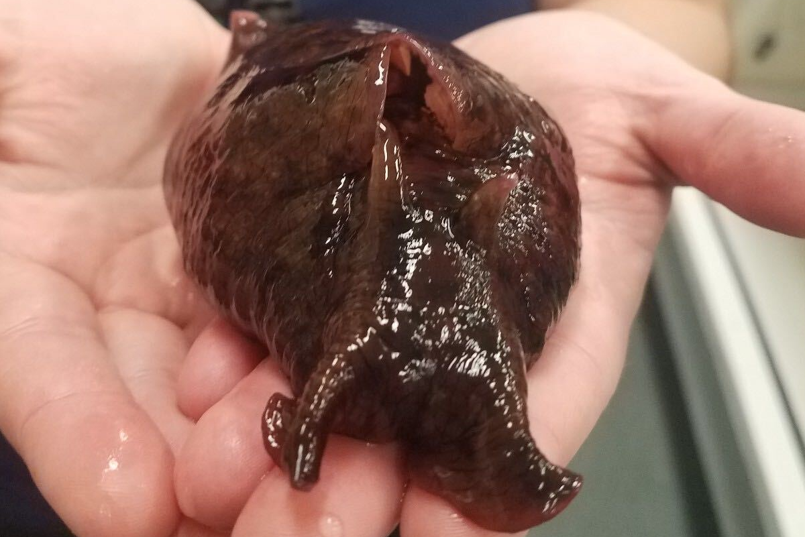

We study the microbial communities associated with marine model organisms, combining metabarcoding, genomics, and transcriptomics to understand how microbiomes contribute to host physiology and the broader ocean carbon cycle.

### Biomineralisation in the Gulf Toadfish microbiome

Marine teleost fish precipitate CaCO₃ in their intestines as part of their osmoregulatory strategy, a process that may account for up to 15% of total calcium carbonate deposition in the ocean. Despite its significance, the molecular mechanisms driving this reaction remain unknown — no candidate genes have been identified in the fish genome or transcriptome of the Gulf Toadfish (*Opsanus beta*), the primary model for studying this process.

We are testing the hypothesis that gut microbiota — rather than the fish itself — are responsible for intestinal carbonate precipitation. Bacteria are well-established agents of calcium carbonate deposition in marine environments, and their role in analogous processes (such as kidney stone formation) has been documented in mammals. Using a combination of 16S/18S metabarcoding, metagenomics, and transcriptomics, we are characterising the microbial communities of the toadfish gut and identifying candidate bacteria driving CaCO₃ deposition. Understanding this process is critical for accurate modelling of ocean carbon dynamics and for exploring marine microbiome-based carbon sequestration strategies.

**Key publications**

Oehlert AM, Garza J, Nixon S, et al., including **Javier del Campo** & Grosell M (2024). [Implications of dietary carbon incorporation in fish carbonates for the global carbon cycle](https://www.sciencedirect.com/science/article/abs/pii/S0048969724000299). *Science of the Total Environment*, 916, 169895.

Preprint: [Symbiotic bacteria support calcium carbonate precipitation in the Gulf Toadfish gut](https://www.biorxiv.org/content/10.1101/2025.10.07.681008). *bioRxiv* (2025).

---

### The microbiome of the California sea hare

  
  Photo by Elizabeth Whitson

The California sea hare, *Aplysia californica*, is a well-studied model organism in neurobiology and neuroscience. Despite deep knowledge of its physiology, anatomy, and ethology, little is known about its microbiome. In collaboration with the National Resource for *Aplysia* at the Rosenstiel School of Marine and Atmospheric Science, we are exploring for the first time the prokaryotic and microeukaryotic communities associated with this organism using a genomic, metabarcoding approach. These data will allow us to investigate how the microbiome influences behaviour, ageing, and other characteristics of this important model animal.
