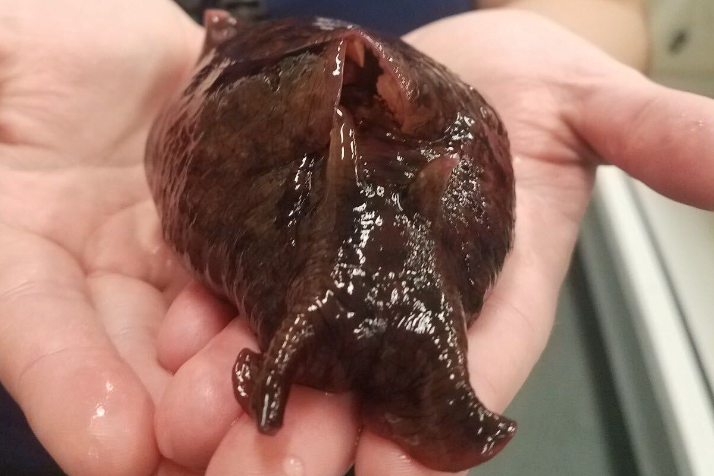

We study the microbial communities associated with marine model organisms, combining metabarcoding, genomics, and transcriptomics to understand how microbiomes contribute to host physiology and the broader ocean carbon cycle.

### Biomineralisation in the Gulf Toadfish microbiome

Marine teleost fish precipitate CaCO₃ in their intestines as part of their osmoregulatory strategy, a process that may account for up to 15% of total calcium carbonate deposition in the ocean. Despite its significance, the molecular mechanisms driving this reaction remain unknown — no candidate genes have been identified in the fish genome or transcriptome of the Gulf Toadfish (*Opsanus beta*), the primary model for studying this process.

We are testing the hypothesis that gut microbiota — rather than the fish itself — are responsible for intestinal carbonate precipitation. Bacteria are well-established agents of calcium carbonate deposition in marine environments, and their role in analogous processes (such as kidney stone formation) has been documented in mammals. Using a combination of 16S/18S metabarcoding, metagenomics, and transcriptomics, we are characterising the microbial communities of the toadfish gut and identifying candidate bacteria driving CaCO₃ deposition. Understanding this process is critical for accurate modelling of ocean carbon dynamics and for exploring marine microbiome-based carbon sequestration strategies.

**Key publications**

Oehlert AM, Garza J, Nixon S, et al., including **Javier del Campo** & Grosell M (2024). [Implications of dietary carbon incorporation in fish carbonates for the global carbon cycle](https://www.sciencedirect.com/science/article/abs/pii/S0048969724000299). *Science of the Total Environment*, 916, 169895.

Preprint: [Symbiotic bacteria support calcium carbonate precipitation in the Gulf Toadfish gut](https://www.biorxiv.org/content/10.1101/2025.10.07.681008). *bioRxiv* (2025).

---

### The microbiome of the California sea hare

  
  Photo by Elizabeth Whitson

The California sea hare, *Aplysia californica*, is a well-studied model organism in neurobiology and neuroscience. Despite deep knowledge of its physiology, anatomy, and ethology, little is known about its microbiome. In collaboration with the National Resource for *Aplysia* at the Rosenstiel School of Marine and Atmospheric Science, we are exploring for the first time the prokaryotic and microeukaryotic communities associated with this organism using a genomic, metabarcoding approach. These data will allow us to investigate how the microbiome influences behaviour, ageing, and other characteristics of this important model animal.

---

### Bryozoan microbiomes under climate stress

Bryozoans are colonial, mostly calcifying invertebrates that are abundant and habitat-forming on Mediterranean reefs, yet their microbiomes — and how those communities respond to a changing ocean — remain barely explored. In a series of collaborative studies led by Blanca Figuerola, together with Joaquim Garrabou and colleagues, we are characterising bryozoan-associated microbial communities and asking whether they can serve as a window onto invertebrate health under climate stress.

Following the unprecedented 2022 Mediterranean marine heatwave, we carried out the first characterisation of a bryozoan microbiome after such an event, in the common species *Myriapora truncata*. Even in colonies showing no visible necrosis, the microbiome had shifted at both depths sampled, with a loss of potential core members and signs of early dysbiosis that were most pronounced in the shallower, warmer colonies — suggesting that host-associated microbes can act as early bioindicators of sublethal thermal stress.

Looking ahead to the conditions of the future ocean, we also compared bryozoans living inside and outside a volcanic CO₂ vent — a natural analogue for ocean acidification — to disentangle the interactive effects of acidification and warming. Bryozoans showed some capacity to acclimatise to acidification, adjusting their skeletal properties while maintaining a relatively stable microbiome, yet they still lost microbial genera with key functional roles, and acidification exacerbated the colony cover loss and mortality driven by warming. Together, these studies point to measurable — and potentially consequential — microbiome disruption in bryozoans under the combined pressures of a warming, acidifying Mediterranean.

**Key publications**

Figuerola B, Linares C, Aparicio-Estalella C, López-Sendino P, Garrabou J, **del Campo J** (2025). [Microbiome composition in a common Mediterranean bryozoan following an unprecedented marine heatwave](https://doi.org/10.1111/1758-2229.70185). *Environmental Microbiology Reports* 17, e70185.

Figuerola B, Capdevila P, Cerdà-Domènech M, Garrabou J, Mirasole A, Bassols P, **del Campo J**, Teixidó N (2025). [Interactive effects of ocean acidification and warming disrupt calcification and microbiome composition in bryozoans](https://doi.org/10.1038/s42003-025-08524-8). *Communications Biology* 8, 1135.
