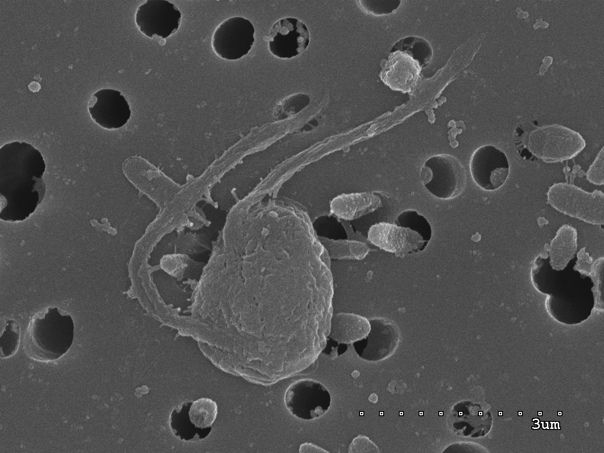

Reference genomes are the foundation for studying biodiversity and evolution — yet the genomic catalogue of life is deeply skewed. Around 85% of sequenced eukaryotic genomes belong to multicellular organisms (animals, fungi, and land plants), even though those lineages account for only ~23% of the eukaryotic diversity seen in environmental surveys. The vast majority of eukaryotes — above all the protists — remain genomically dark, distorting our picture of what a eukaryote is and how eukaryotic life evolved. We work to fill those gaps, generating reference genomes across the tree of life and contributing to the coordinated initiatives that make biodiversity genomics equitable and reproducible: the global [Earth BioGenome Project](https://www.earthbiogenome.org/) (EBP) and its Catalan ([CBP / Biogenoma](https://www.biogenoma.cat/)) and European ([ERGA](https://www.erga-biodiversity.eu/)) nodes.

### Coordinated initiatives: EBP, ERGA and the Catalan BioGenome Project

We are part of the **Catalan Initiative for the Earth BioGenome Project (CBP)**, an EBP-affiliated network aiming to sequence the more than 40,000 eukaryotic species estimated to live in the Catalan-speaking territories — a Mediterranean biodiversity hotspot that, despite covering less than 1% of Europe, holds about a quarter of all known European eukaryotic species, many of them endemic and threatened.

At the European scale, we contribute to the **European Reference Genome Atlas (ERGA)**, the European node of the EBP, which is piloting a decentralised, equitable and inclusive model for producing reference genomes across the continent. We also take part in community efforts to solve the unglamorous but decisive early steps of any genome project — permits, sample handling, accurate species identification, and high-quality DNA extraction — that so often determine whether a high-quality assembly is possible at all.

### Genomes across the tree of life

**Protists — *Mediocremonas mediterraneus*.**

  
  Photo by Javier del Campo

As part of the CBP, we are generating the reference genome of *Mediocremonas mediterraneus*, a heterotrophic nanoflagellate isolated from Blanes Bay (Catalonia). *M. mediterraneus* belongs to the Developea within the supergroup Stramenopiles and, based on phylogenomics, the Developea are sister to all photosynthetic Stramenopiles (diatoms, kelps, and relatives) — making this genome an ideal vantage point for studying the evolutionary origins of photosynthesis in one of the ocean's most important lineages.

**Corals — reference genomes for Mediterranean species.** Mediterranean corals are critically threatened by the climate crisis, and for most of them no reference genome exists. Through Biogenoma we are sequencing chromosome-level genomes for nine species that span both major coral lineages (Hexacorallia and Octocorallia) and a wide range of life histories — hard and soft, solitary and colonial, symbiotic and aposymbiotic: *Caryophyllia inornata*, *Balanophyllia europaea*, *Oculina patagonica*, *Leptogorgia sarmentosa*, *Maasella edwardsi*, *Paramuricea grayi*, *Pennatula rubra*, *Pteroeides griseum*, and *Veretillum cynomorium*. None are currently registered in any genome-sequencing pipeline, so each assembly would be the first of its kind. Realising them means solving coral-specific problems — recovering high-molecular-weight DNA and Hi-C for chromosome-scale scaffolding, assembling a clean host genome from a rich microbiome, and recovering the genomes of associated cobionts — and we are committed to releasing the protocols and workflows alongside the data, treating each coral as a holobiont rather than a single organism.

**Animals — the redlip blenny.** Beyond protists and corals, we contribute chromosome-scale assemblies for other animals, such as the redlip blenny (*Ophioblennius macclurei*), a reef fish whose ~530 Mb genome we assembled to chromosome scale by combining Oxford Nanopore long reads, Illumina short reads, and Hi-C scaffolding — a resource for studying the diversity and evolutionary history of the group.

### From genomes to evolution

Reference genomes are a means, not an end: they let us read evolution. Protists — the bulk of eukaryotic diversity — hold the keys to some of biology's deepest questions, from the origin of the eukaryotic cell and of chloroplasts to the repeated emergence of multicellularity and symbiosis, yet they remain the most genome-poor branch of the tree. We have made this case both for an international audience and for a Catalan readership, and it directly frames our own genome projects — *Mediocremonas*, for instance, sits exactly where a genome can illuminate the origin of photosynthesis in the Stramenopiles. Filling in these branches is how a catalogue of genomes becomes an account of how eukaryotic life came to be.

**Key publications**

Corominas M, Marquès-Bonet T, Arnedo MA, et al., including **del Campo J** (2024). [The Catalan initiative for the Earth BioGenome Project: contributing local data to global biodiversity genomics](https://doi.org/10.1093/nargab/lqae075). *NAR Genomics and Bioinformatics* 6, lqae075.

Mc Cartney AM, Formenti G, Mouton A, et al., including **del Campo J** (2024). [The European Reference Genome Atlas: piloting a decentralised approach to equitable biodiversity genomics](https://doi.org/10.1038/s44185-024-00054-6). *npj Biodiversity* 3, 28.

Reichel K, Pohjoismäki J, Astrin JJ, et al., including **del Campo J** (2026). [From permits to samples: addressing key challenges for high-quality reference genome generation in Europe](https://doi.org/10.1111/1755-0998.70100). *Molecular Ecology Resources* 26, e70100.

Kulikov N, Joffroy K, Bonacolta AM, **del Campo J**, Irisarri I (2025). [The chromosome-scale genome assembly of the redlip blenny, *Ophioblennius macclurei* (Blenniidae)](https://doi.org/10.1093/gbe/evaf242). *Genome Biology and Evolution* 18, evaf242.

Schoenle A, Francis O, Archibald JM, et al., including **del Campo J** (2025). [Protist genomics: key to understanding eukaryotic evolution](https://doi.org/10.1016/j.tig.2025.05.004). *Trends in Genetics* 41, 868–882.

Massana R, Logares R, López-Escardó D, **del Campo J** (2022). [Protists, la principal font de diversitat genòmica en eucariotes](https://www.raco.cat/index.php/TreballsSCBiologia/article/view/409873). *Treballs de la Societat Catalana de Biologia* 72.
